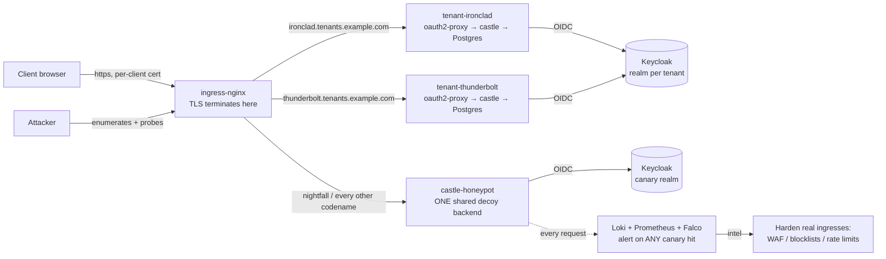

# Castle on Kubernetes — per-client instances + canary swarm

This directory deploys castle as a **multi-tenant platform**: every client gets
their **own isolated instance** on their own army-codename subdomain, and a large
**swarm of look-identical decoy subdomains** surrounds them as honeypots. Real
tenants are needles in a haystack of canaries — an attacker who enumerates and
probes subdomains can't tell which are real, and **every touch of a decoy is
high-signal intel** we use to harden the real instances.

Access is via a **normal browser** (no VPN, no client software). No public
self-registration — instances are provisioned by the operator.

> Status: reviewed drafts. They have not been applied to a live cluster. The
> tenant chart passes `helm template`; the standalone manifests pass YAML
> validation. Treat the "Known limitations" section as the punch-list.

---

## Request flow



Real tenants and canaries are **indistinguishable from outside**: same image,
same single-host cert issued the same way, same redirect-to-SSO behaviour. Only
the backend and namespace differ.

---

## What's here

| File | Purpose |
|------|---------|
| `../../Dockerfile` | Multi-stage build for the castle image (tenants **and** honeypot run it) |
| `00-platform.yaml` | Namespaces, cert-manager `ClusterIssuer`, Kata `RuntimeClass` |
| `tenant/` | Helm chart for **one real tenant** (the reusable unit) |
| `honeypot.yaml` | The single shared decoy backend + hard lockdown + a sample decoy route |
| `monitoring.yaml` | Prometheus alerts, Promtail scrape, Falco rules for the swarm |

---

## Prerequisites

Install these platform add-ons first (Helm):

```bash
# Ingress: the single, hardened TLS-termination point
helm install ingress-nginx ingress-nginx/ingress-nginx -n ingress-nginx --create-namespace

# Certificates
helm install cert-manager jetstack/cert-manager -n cert-manager --create-namespace \
  --set crds.enabled=true

# Monitoring / detection (optional but recommended)
helm install kube-prometheus-stack prometheus-community/kube-prometheus-stack -n monitoring --create-namespace
helm install loki grafana/loki-stack -n monitoring          # Loki + Promtail
helm install falco falcosecurity/falco -n monitoring

# Kernel isolation (optional): install the Kata runtime on the nodes, or remove
# `runtimeClassName` from tenant values + honeypot.yaml if unavailable.
```

Then the shared platform layer:

```bash
kubectl apply -f deploy/k8s/00-platform.yaml
```

Edit `00-platform.yaml` first: set the ACME contact email, and your DNS so that
`*.tenants.example.com` (or each provisioned host) points at the ingress LB.

---

## Build & push the image

```bash
docker build -t ghcr.io/your-org/castle:0.1.0 .
docker push ghcr.io/your-org/castle:0.1.0
```

The same image serves a real tenant (Postgres, proxy auth) or a canary (throwaway
sqlite) — only env/args differ, which is what keeps them fingerprint-identical.

---

## Provision a real tenant

Per client, the control plane assigns a codename, creates a Keycloak realm, and
installs the chart:

```bash
helm install castle-ironclad deploy/k8s/tenant \
  --namespace tenant-ironclad --create-namespace \
  --set codename=ironclad \
  --set baseDomain=tenants.example.com \
  --set image.repository=ghcr.io/your-org/castle --set image.tag=0.1.0 \
  --set keycloak.issuerUrl=https://sso.example.com/realms/ironclad \
  --set keycloak.whitelistDomain=sso.example.com \
  --set secrets.jwtSecret="$(openssl rand -base64 48)" \
  --set secrets.dbPassword="$(openssl rand -hex 24)" \
  --set secrets.oauth2ClientSecret="<from Keycloak client>" \
  --set secrets.oauth2CookieSecret="$(openssl rand -hex 16)"
```

This creates a namespace with: castle + oauth2-proxy (one pod), a per-tenant
Postgres, an uploads PVC, the Service/Ingress (single-host cert), and the four
NetworkPolicies. castle auto-migrates its DB on boot.

Users are added the way we already built it: create them in the tenant's Keycloak
realm, then a manager onboards them by email in-app (invite reconciles on first
SSO login). **No self-registration.**

Codename ↔ client mapping is a **control-plane secret** — never put the client's
real name in the codename, values, or labels.

---

## The canary swarm

Deploy the one shared backend once:

```bash
kubectl apply -f deploy/k8s/honeypot.yaml   # includes a sample decoy: nightfall
```

Then, per decoy codename, the control plane stamps an `Ingress` + `Certificate`
in `castle-honeypot` pointing at the `honeypot` Service (copy the sample block).
Because they all share one backend, the swarm costs one Deployment no matter how
many codenames you float. **Skew the pool heavily toward decoys** so real tenants
are rare.

Keep decoys indistinguishable: same cert issuer, single-host cert, same ingress
annotations. The only difference an attacker can ever observe is behavioural
after login — see limitations.

---

## Local testing (kind + Calico)

Prove the whole thing on a throwaway cluster — one command, no cloud, no DNS, no
certs:

```bash
./deploy/k8s/local-test.sh          # create kind+Calico+ingress, deploy, run checks
./deploy/k8s/local-test.sh down     # tear it all down
```

It stands up kind with **Calico** (so NetworkPolicies actually enforce — kind's
default CNI does not), installs ingress-nginx, builds + loads the castle image,
deploys two tenants and a decoy via the chart, and verifies:

1. **Routing** — each `*.127.0.0.1.nip.io` subdomain reaches its own backend pod.
2. **Isolation** — cross-tenant traffic is blocked, an allowed path (DNS) works,
   and an A/B (add allow-policy → it connects) proves Calico is the enforcer.
3. **Detection** — hits on the decoy host are recorded (the `CanaryTouched` signal).

This exercises the chart in **local mode** via two toggles that are also useful
in production:

- `oauth2Proxy.enabled=false` — run castle directly (no IdP needed locally; in
  prod, for fronting with an external proxy). castle then binds `0.0.0.0` and the
  Service/NetworkPolicy target its port.
- `database.internal=false` + `database.externalUrl=…` — skip the bundled
  Postgres and point at an external DB (a managed Postgres in prod; sqlite on a
  mounted path for local tests).

> In a network-restricted environment where the kind node can't reach registries,
> pre-pull the Calico/ingress/castle images on the host and `kind load` them.

**Testing the real SSO path** (Keycloak + oauth2-proxy, not just built-in login):
`deploy/k8s/local-keycloak.yaml` stands up a shared Keycloak with a per-tenant
realm and documents the exact `helm` command to deploy a proxy-mode tenant wired
to it. Because the IdP is in-cluster behind the ingress, the tenant uses the
chart's `externalPort` (so redirect URIs carry `:8443`) and `oauth2Proxy.extraArgs`
for split-horizon (browser hits Keycloak via the ingress; the pod reaches it via
the in-cluster service). Verified end to end: login through Keycloak →
group→role (`castle-managers`→manager, `-staff`→staff, `-clients`→client) →
provisioned into the tenant. This exercises the actual production auth path.

## Managing instances (`castlectl`)

`deploy/k8s/castlectl.sh` is a minimal provisioner — the seed of the control
plane — so managing instances is one command instead of hand-run `helm`:

```bash
castlectl provision ironclad            # stamp out a tenant
castlectl provision nightfall --decoy   # stamp out a decoy
castlectl list                          # table of all managed instances
castlectl deprovision ironclad          # remove one   (or: deprovision --all)
```

Defaults are local (built-in login + sqlite + no Kata, via `MODE=local`); env
vars (`IMG_REPO`, `BASE_DOMAIN`, `MODE`) point it at a real image/domain, and in
prod it would additionally create the per-tenant Keycloak realm and record the
codename↔client mapping in the control plane's secret store (never on disk here).
It's `helm upgrade --install` under the hood, so it composes with everything else.

## Backups & restore

Each tenant with an internal Postgres can run a scheduled logical backup
(`backup.enabled: true`): a CronJob does `pg_dump --format=custom` **and** tars
the uploads volume into a scratch dir, then a second step pushes it to
S3-compatible object storage (`minio/mc`). Enable per tenant:

```bash
helm ... --set backup.enabled=true \
  --set backup.s3.endpoint=https://s3... --set backup.s3.bucket=castle-backups \
  --set backup.s3.credentialsSecret=castle-backup-s3 \
  --set-json 'backup.egress=[{"to":[{"ipBlock":{"cidr":"0.0.0.0/0","except":["10.0.0.0/8","172.16.0.0/12","192.168.0.0/16"]}}],"ports":[{"protocol":"TCP","port":443}]}]'
```

Notes:
- **RPO = `backup.schedule`** (default hourly); no PITR — see the CloudNativePG
  upgrade below.
- **Egress:** the tenant's default-deny egress blocks the object store, so
  `backup.egress` opens the store target for the backup pod (external HTTPS, or
  an in-cluster MinIO namespace:port).
- **Retention** = a **bucket lifecycle policy** (e.g. expire after N days) — not
  done by the CronJob.
- **Uploads:** backed up in the same job; mounting the RWO uploads PVC works when
  the backup pod lands on the app's node — use RWX or object-storage-backed
  uploads on multi-node clusters.

**Restore** (validated on kind): pull the latest dump from the bucket and
`pg_restore` it into a fresh database:
```bash
mc cp s/castle-backups/<release>/db-<ts>.dump ./db.dump
createdb castle_restore && pg_restore -d castle_restore ./db.dump
```
Test restores regularly — an untested backup isn't one.

**Upgrade path — CloudNativePG** for **point-in-time recovery** (WAL archiving →
restore to any second) + HA replicas, when RPO/uptime requirements outgrow
scheduled logical dumps. It replaces the raw Postgres StatefulSet with a managed
`Cluster` and is the recommended prod DB when "can't lose the last hour" is real.

## Certificates & the 50-cert initial phase

- **One single-host cert per subdomain** (real and decoy) — no wildcard, no
  shared SAN list. CT logs will show opaque codenames, which reveal a count and
  some names but **never a client identity**; that's the accepted trade.
- Issued from Let's Encrypt via **HTTP-01** (credential-free) through
  ingress-nginx. LE's ~**50 certs / registered domain / week** is fine for the
  initial phase (real tenants + a starter decoy pool).
- To scale the swarm later: raise the LE rate limit, use a commercial ACME CA,
  or switch the `ClusterIssuer` to **DNS-01** (also lets you issue without
  exposing an HTTP challenge path).

---

## TLS termination model

Initial phase: **ingress-nginx terminates TLS** — one hardened, well-understood
component holding the certs. Cross-tenant **data** breach is prevented behind it
by namespace + NetworkPolicy + (optional) Kata isolation: a compromised tenant
pod has no path to any other tenant or its data.

Hardening upgrade (documented, not enabled): to remove even the central-plaintext
point, switch ingress-nginx to **SSL passthrough** and terminate TLS *inside*
each pod (oauth2-proxy serving its own cert). Then the ingress only SNI-routes and
never sees plaintext or holds keys. It's more moving parts (per-pod cert mounts,
per-host honeypot certs), so it's deferred past the initial phase.

---

## Network isolation ("prevent cross-tenant breach at all cost")

Every namespace is **default-deny** (ingress + egress). Explicit allows only:

- **Tenant app:** inbound only from `ingress-nginx` on 4180; egress only to DNS,
  its own Postgres, and **external** HTTPS (the IdP). RFC1918 is *excluded* from
  the 443 egress rule, so a popped pod can't pivot to in-cluster services.
- **Tenant Postgres:** inbound only from its own app pods.
- **Honeypot:** the tightest policy in the cluster — inbound only from ingress,
  egress only to DNS + external IdP. A fully compromised honeypot reaches
  nothing: no tenant, no internal service, no data.

castle binds to `127.0.0.1`, so the only thing that can reach it is the
oauth2-proxy in the same pod. That loopback binding — not a shared secret — is
the isolation, which is why `CASTLE_PROXY_SECRET` is intentionally empty here.

---

## Monitoring & the feedback loop

- **`CanaryTouched`** fires on *any* request to a decoy host (ingress-nginx
  request metric) — the core detection.
- **`CanaryCredentialStuffing`** fires on bursts of auth failures at the decoy
  login (the canary realm keeps those attempts away from real identities).
- **`CanaryRealmLoginAttempt`** (Loki rule) fires on *any* login attempt in a
  **canary realm** at Keycloak — the auth-layer counterpart for indistinguishable
  decoys. Canary realms have zero legitimate users, so every attempt is an
  attacker; the alert carries the tried username + source IP. The control plane
  maintains the canary-realm matcher (its secret decoy list).
- Honeypot logs ship to Loki tagged `signal=deception` for source-IP / payload /
  tried-username analysis; **Falco** catches a shell or unexpected egress inside
  any castle pod (the breakout a honeypot exists to catch).
- **Feedback loop:** intel from the swarm → block the IPs, add WAF rules, and
  tune rate limits on the **real** tenant ingresses before those actors reach a
  real client.

---

## Security / threat model summary

| Protected | How |
|-----------|-----|
| Cross-tenant data breach | namespace-per-tenant + default-deny NetworkPolicies + per-tenant DB + optional Kata |
| Client identity from subdomain | opaque army codenames; mapping is a control-plane secret |
| Which subdomains are real | canary swarm — decoys are indistinguishable from outside |
| Attacker recon paying off | every decoy hit alerts; intel hardens real instances |
| App compromise → passwords | proxy auth: castle stores no SSO passwords |

**Residual risks (accepted / deferred):** subdomains are guessable via DNS/CT
(mitigated by the swarm, not hidden); ingress-nginx sees tenant plaintext until
the SSL-passthrough upgrade; SNI leaks the codename on the wire (ECH is
opportunistic and not enforced — see project history).

---

## Known limitations & follow-ups

1. **Decoy fidelity — two modes:**
   - **Indistinguishable (recommended for the swarm):** a decoy runs exactly like
     a real tenant — **proxy mode** pointed at its own **canary realm** on the
     *same* Keycloak (opaque codename, no users). It presents the identical SSO
     redirect (same IdP host), so it can't be told apart from a real tenant — no
     separate IdP subdomain, no local login form. Any auth attempt is an attacker,
     captured as a Keycloak `LOGIN_ERROR` (tried username + source IP) plus an
     ingress hit (`CanaryTouched`). Trade-off: **Keycloak never logs the password**.
     (See `local-keycloak.yaml`'s `castle-nightfall` realm + the proxy-mode decoy.)
   - **Credential-capturing (distinguishable):** honeypot mode
     (`CASTLE_HONEYPOT=true`, jwt) serves the built-in login form and logs the
     submitted **email+password**+metadata to `castle::honeypot`, persisting
     nothing. Captures the password, but a local form is a tell vs SSO tenants.

   Getting **both** (indistinguishable *and* password capture) needs a custom
   Keycloak authenticator SPI in the canary realm — a future option. Also pending:
   a tarpit (deliberately slow responses) and realistic seeded fake findings.
2. **Canary realm naming.** A real tenant's SSO redirect exposes its realm name.
   Use realistic per-decoy realm names (or a shared realm with per-tenant clients)
   so the redirect doesn't betray decoys.
3. **Cert scale.** Past ~50 certs/week, move off Let's Encrypt HTTP-01 (see
   Certificates).
4. **Secrets.** The tenant chart templates secrets from install values for
   convenience. Before real client data, use sealed-secrets / external-secrets
   and a proper Keycloak client-secret source.
5. **Management plane not included here.** The cross-client dashboard + client
   switcher (behind VPN + mTLS) is a separate, higher-assurance component and is
   deliberately out of this manifest set.
6. **Postgres HA/backups.** The per-tenant Postgres is a single StatefulSet. Add
   backups (e.g. CloudNativePG or scheduled dumps) before production.

---

## Decommission a tenant

```bash
# Export/retain data first (real client data — not throwaway).
helm uninstall castle-ironclad -n tenant-ironclad
kubectl delete namespace tenant-ironclad     # removes PVCs too
# Then remove the Keycloak realm and the DNS record.
```
